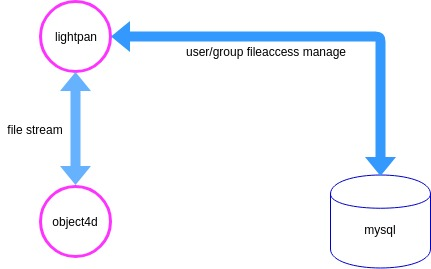

# 搭建后端开发环境

## 总体架构


##  安装golang
```
git clone  https://github.com/light4d/lightpan
export GOPATH=系统GOPATH：项目GOPATH（可以看到lightpan项目里，有个GOPATH文件夹，这就是项目GOPATH）
cd lightpan/GOPATH/src/github.com/light4d/lightpan
go get
```

这里建议把object4d项目，放在系统GOPATH对应的目录下GOPATH/src/github.com/light4d/object4d
##  安装依赖组件

+ mysql
+ redis

缓存token
+ [object4d](https://github.com/light4d/object4d)

由object提供4d存储
##  更改配置文件
cp GOPATH/bin/config.json /etc/lightpan/config.json
vim /etc/lightpan/config.json
##  后端接口文档

doc/lightpan.postman_collection.json

用Postman导入,设置环境变量
```
mhost:http://{{host}}:9003
fhost:http://{{host}}:9002
ohost:http://{{host}}:9001
ahost:http://{{host}}:9004
host:localhost
rhost:47.107.102.188
```

lightpan后端程序，会开启3个端口对外服务
+ 9002 file端口

供前端调用
+ 9003 manage端口

供前端调用
+ 9004 前端文件端口

参考 github.com/light4d/lightpan/router/app.go,
9004会将配置文件的dist指定的目录映射给浏览器
##   数据库建表
bin/db.sql


## 命令执行
```
./lightpan /etc/lightpan/config.json
```
##  最终打包

```
docker built -t light4d/lightpan .
```